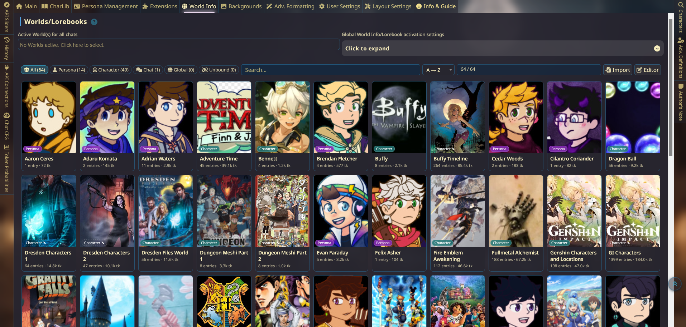
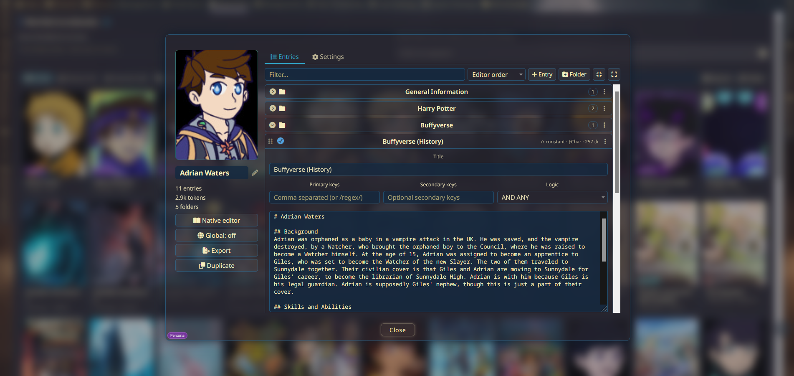
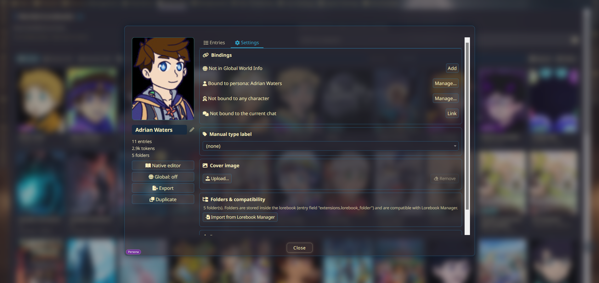
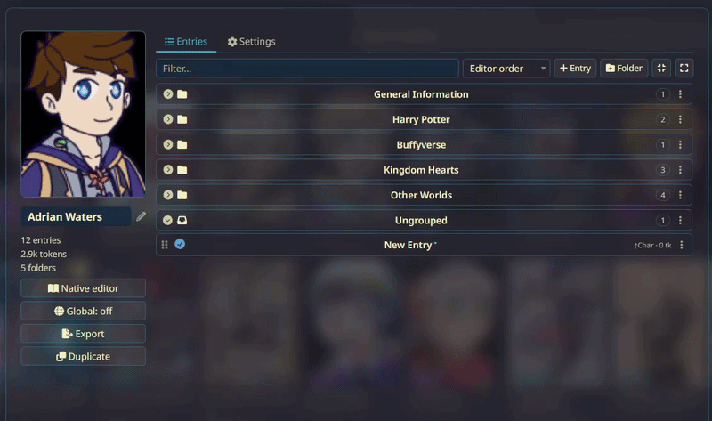

# World Info Gallery

A gallery-first browser and editor for SillyTavern **World Info / Lorebooks**. The World Info tab opens into a visual library of your lorebooks — covers, folders, classification, and a full in-place entry editor — while the native editor stays one click away. Nothing is replaced: the gallery is additive, and the standard editor (with a folder filter bar on top) remains fully available.



## Features

### 🖼️ Gallery view
- The World Info tab opens on a card grid of every lorebook: cover image, entry count, token count, and binding badges
- Custom cover images — or covers derived automatically from the bound character's / persona's avatar
- Filter chips (**All / Current / Persona / Character / Chat / Global / Unbound**), text search, and sorting by name, entries, or tokens
- Import lorebook files and open the native editor straight from the toolbar
- Placeholder covers: first-letter or word-initial monograms for books without images.

### 📖 Book detail popup
Click any card to open the detail popup:
- **Sidebar** — cover (click to change), inline rename, live entry / token / folder stats, binding badges, and quick actions: *Native editor · Global toggle · Export · Duplicate*
- **Entries tab** — collapsible folders with drag & drop, plus the full entry editor
- **Settings tab** — manage every binding (persona / character / chat / global), manual labels, cover image, Lorebook Manager import, and deletion




### 📁 Entry folders
- Group entries into collapsible, reorderable folders
- Drag entries onto folder headers to move them; drag folder headers to reorder (top half of the target = above, bottom half = below)
- **Folders are stored inside the lorebook file itself** (`entry.extensions.lorebook_folder`) — they survive exports, imports, and travel with the book anywhere
- **Lorebook Manager compatible**: existing Lorebook Manager folders import automatically on first open, and folder changes are mirrored back so both extensions agree
- A folder filter bar is also injected into the native editor



### 🔗 Classification & bindings
Badges are derived from *live* bindings, not just labels:

| Badge | Source |
|---|---|
| **Character** | primary lorebook or additional character lorebooks |
| **Persona** | persona lorebook assignment |
| **Chat** | the current chat's lorebook |
| **Global** | active in Global World Info |

- Assign / remove any binding from a card's context menu or the popup's Settings tab — using the same mechanisms SillyTavern itself uses
- Optional manual labels for unbound books (shown with a dashed ✎ badge)
- Renaming a book **relinks every binding** that referenced the old name

### ✏️ Full entry editor
Every field the native editor offers, inline: title, primary/secondary keys with logic, content with a **live token counter**, all 8 insertion positions, order / depth / role, constant & vectorized, matching options (case sensitivity, whole words, scan depth), the six extra scan sources, probability, inclusion groups, timed effects (sticky / cooldown / delay), recursion options, automation ID, and character filters.

### 🔢 Real token counts
Token counts use the active tokenizer and SillyTavern's token cache — per entry, per book, and per gallery card. Counts fall back to a length estimate (marked with `~`) only if the tokenizer is unavailable.

### 🛡️ Draft protection
- Unsaved edits are marked with a dot on the entry title and **survive list rebuilds** — searches, filter changes, background refreshes, even book renames
- Closing the popup with unsaved edits asks for confirmation, on every close path (Close button, Escape, navigation)

## Installation

1. In SillyTavern, open **Extensions** (magic wand icon) → **Manage Extensions**
2. Click **Install extension** and paste the repository URL:

   ```
   https://github.com/Shin-F/world-info-gallery
   ```

3. Enable **World Info Gallery**, then hard-refresh the page (Ctrl+Shift+R)

Manual install: clone or copy the repo into `SillyTavern/public/scripts/extensions/third-party/` — any folder name works.

The extension's options (gallery as default view, token counts, avatar-derived covers) are in the **Extensions panel → World Info Gallery**.

## Requirements

- SillyTavern **1.13.4+** (manifest minimum); developed and tested against current release builds, with automatic fallbacks on several older API paths

### Optional integrations

| Extension | Relationship |
|---|---|
| [Lorebook Manager](https://github.com/subzero5544/lorebook-manager) | Shares the same portable folder format — folders import automatically and stay in sync |
| [Moonlit Echoes](https://github.com/RivelleDays/SillyTavern-MoonlitEchoes) | Fully compatible — all styling uses SillyTavern theme variables and standard component classes |
| [ProbablyTooManyTabs](https://github.com/IceFog72/SillyTavern-ProbablyTooManyTabs) | Fully compatible — no native DOM is moved or reparented; all layouts are fluid and reflow with pane resizing |

## Quick reference

| Interaction | Action |
|---|---|
| Click a card | Open the book detail popup |
| Right-click a card | Full book menu (open, cover, bindings, rename, duplicate, export, delete) |
| Click an entry title | Expand / collapse the entry editor |
| Drag an entry row (collapsed) | Move the entry onto a folder header |
| Drag a folder header | Reorder folders |
| Click the popup cover | Change cover image |
| Click the book name in the popup | Rename (bindings relink automatically) |
| Right-click an entry in the native editor | Move it to a folder |
| Esc | Close menus / cancel selection |

## Data & storage

| What | Where it lives |
|---|---|
| Extension settings (covers, labels, folder order, collapse state) | SillyTavern `settings.json` → `extensions.WorldInfoGallery` |
| Cover images | uploaded to the server: `user/images/worldinfo-gallery/` |
| Entry folders | **inside each lorebook file** — `entry.extensions.lorebook_folder` |
| Lorebook Manager sync | `extensions.lorebookFolders` (when LM is installed) |

All API calls go to your own SillyTavern server — the extension makes no external network requests.

## Known limitations

- HTML5 drag & drop doesn't fire on touch devices — use the folder menu's *Move up / Move down* instead
- Editing the same entry simultaneously in the popup and the native editor is last-write-wins (unsaved drafts are marked with a dot)
- With remote tokenizers, the first token-counting pass queues one request per entry; results are cached afterward

## Credits

- **[SillyTavern](https://github.com/SillyTavern/SillyTavern)** — the platform this extends
- **[Character Library](https://github.com/Sillyanonymous/SillyTavern-CharacterLibrary)** — inspiration for the gallery presentation
- **[Lorebook Manager](https://github.com/subzero5544/lorebook-manager)** — the portable folder format this extension shares
- Extension created through extensive consultation with GLM 5.3

## License

MIT
